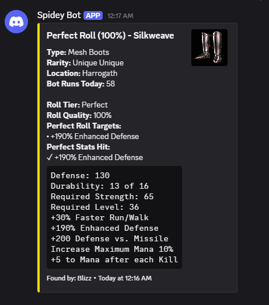
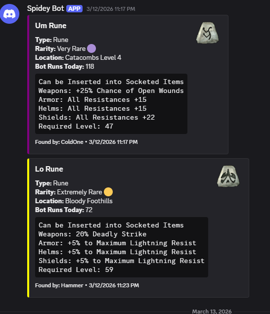
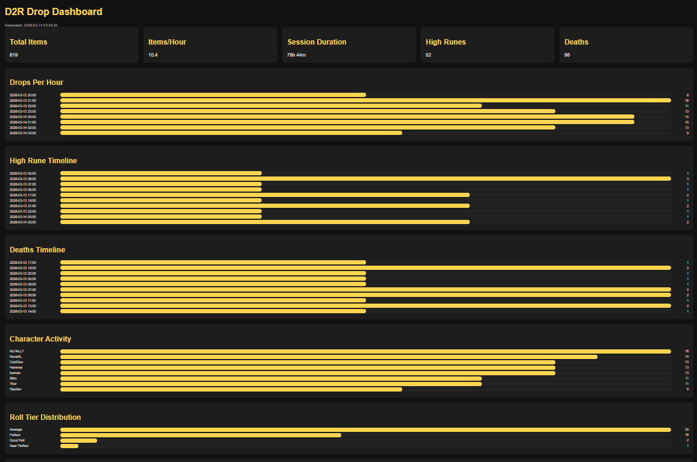
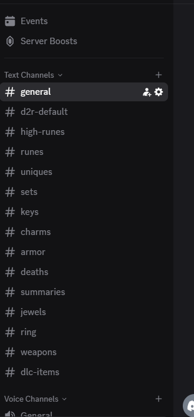
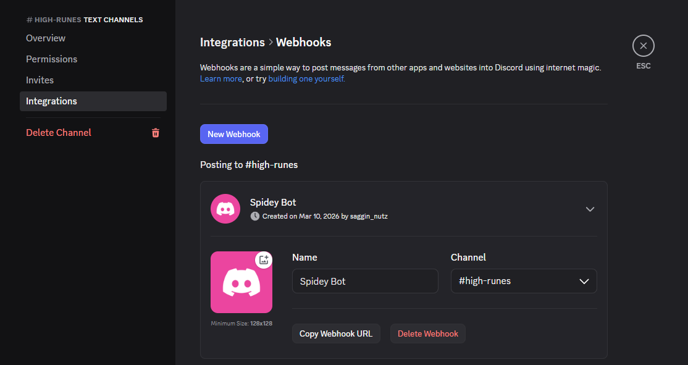
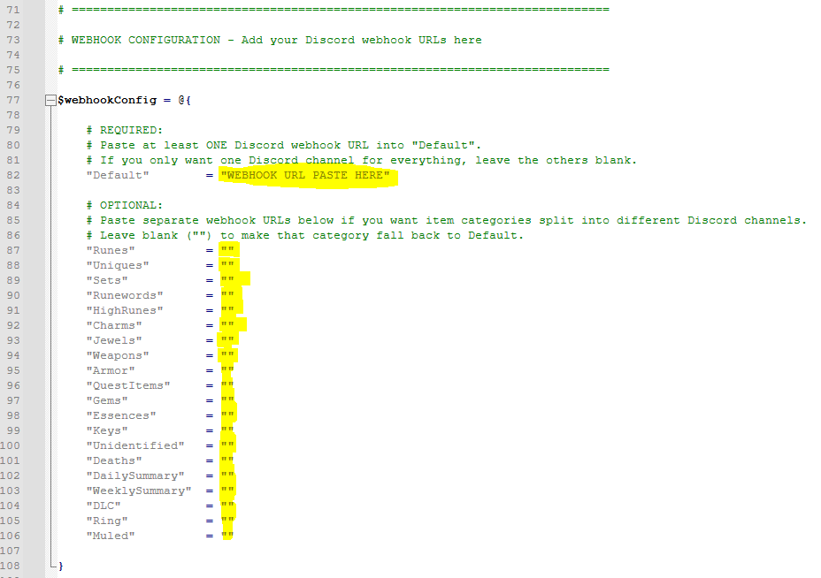
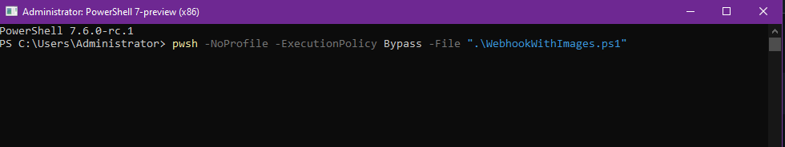

# Diablo II Resurrected – GID Discord Drop Tracker

A **real-time Discord notification system for GID / D2RB bots**.

This script monitors the GID bot log files and automatically posts item drops to Discord with:

• Item images  
• Drop location  
• Character name  
• Roll quality detection  
• Perfect item tracking  
• Farming statistics dashboard  

---

# Example Discord Notifications

## Perfect Item



---

## Rune Drop



---

# Farming Statistics Dashboard



The script automatically builds a dashboard showing:

• Items per hour  
• Rune drop history  
• Farming zone performance  
• Character efficiency  
• Perfect roll tracking  

---

# Folder Structure

Your folder should look like this:



```
WebhookWithImages/
│
├── WebhookWithImages.ps1
│
├── PerfectRollRules.json
├── PerfectRolls.json
├── UniqueItems.json
├── SetItems.json
├── RarityLookup.csv
├── gfx.csv
│
├── Images/
├── Logs/
├── Screenshots/
├── Tools/
│
├── README.md
└── QUICKSTART.txt
```

---

# Requirements

You **must install these first**.

---

# 1 Install PowerShell 7

Download:

https://github.com/PowerShell/PowerShell/releases

Download the **Windows .msi installer**.

Install like any normal program.

---

### Verify installation

Press:

```
Windows Key + R
```

Type:

```
pwsh
```

Press Enter.

You should see a blue PowerShell window.

Example:

```
PowerShell 7.x.x
```

If this does not open, PowerShell 7 is not installed.

---

# 2 Create a Discord Webhook

Open Discord.

Right click the channel you want item drops in.

Click:

```
Edit Channel
```

Then click:

```
Integrations
Webhooks
New Webhook
```

Copy the **Webhook URL**.

Example:



---

# 3 Unblock the Script (IMPORTANT)

Windows blocks downloaded scripts for security.

If you skip this step the script will not run.

Right click:

```
WebhookWithImages.ps1
```

Click:

```
Properties
```

At the bottom check:

```
Unblock
```

Click **OK**.

Example:


---

# 4 Configure the Script

Open:

```
WebhookWithImages.ps1
```

Use **Notepad++** or **Notepad**.

---

### Find the webhook configuration

Around **line 80** you will see:

```powershell
$webhookConfig = @{
```

Example:



---

Replace this line:

```powershell
"Default" = "YOUR_WEBHOOK_URL_HERE"
```

with your webhook URL.

Example:

```powershell
"Default" = "https://discord.com/api/webhooks/123456789/ABCDEFGHIJKLM"
```

---

### Using ONE webhook only

This is the **simplest setup**.

Everything will post to the same Discord channel.

You only need:

```
Default
```

No other changes required.

---

### Using multiple Discord channels (optional)

You can split item types into different channels.

Available categories:

```
Default
Runes
HighRunes
Uniques
Sets
Runewords
Charms
Jewels
Weapons
Armor
Keys
DLC
Deaths
DailySummary
WeeklySummary
```

If a category does not have a webhook it automatically posts to **Default**.

---

# 5 Configure GID Folder Paths

Find these lines in the script.

Around **line 250**.

```
$lootFolder
$logsDir
```

Example in the script:

```powershell
$lootFolder = "YOUR_GID_FOLDER\D2RB\Looted"
$logsDir = "YOUR_GID_FOLDER\D2RB\Logs"
```

---

### How to find your GID path

1. Open your GID folder in Windows Explorer.

Example:

```
GID-v3.317
```

2. Open the **D2RB** folder.

3. Right click the **Looted** folder.

4. Click:

```
Properties
```

5. Copy the folder path.

Example:

```
C:\Users\Name\Desktop\GID-v3.317\D2RB\Looted
```

---

### Example configuration

```powershell
$lootFolder = "C:\Users\Name\Desktop\GID-v3.317\D2RB\Looted"
$logsDir = "C:\Users\Name\Desktop\GID-v3.317\D2RB\Logs"
```

If the paths are wrong the script will not detect items.

---

# 6 Character Name Mapping (ONLY if needed)

Sometimes the **bot profile name is different from the character name**.

Example:

Profile name:

```
HammerBot
```

Character name:

```
Hammer
```

Around **line 2160** add:

```powershell
$characterToProfileMap = @{
    "Hammer" = "HammerBot"
}
```

---

### If the names are the same

You **do not need to edit anything**.

---

# 7 Run the Script

Open **PowerShell 7**.

Navigate to the script folder.

Example:

```
cd C:\Users\Name\Desktop\WebhookWithImages
```

Run:

```
pwsh -NoProfile -ExecutionPolicy Bypass -File ".\WebhookWithImages.ps1"
```

Example:



Leave this window open.

---

# 8 Start Your GID Bot

Start your bot normally.

When items drop they will appear in Discord automatically.

---

# Dashboard

The script automatically generates:

```
dashboard.html
```

Open it in your browser to see drop statistics.

---

# Troubleshooting

## Nothing posts to Discord

Check:

• Webhook URL correct  
• GID folder paths correct  
• Bot is running  
• Script window still open  

---

## Images not showing

Verify these files exist in the same folder:

```
gfx.csv
Images/
```

Check:

```
image_log.txt
```

---

## Script will not run

Run PowerShell as administrator and execute:

```
Set-ExecutionPolicy -Scope CurrentUser RemoteSigned
```

---

# Security Warning

Do **not share your webhook URLs publicly**.

Anyone with the webhook URL can post messages to your Discord.

---

# Credits

Created by **Saggin_Nutz**  
for the **GID / Diablo II Resurrected bot community**